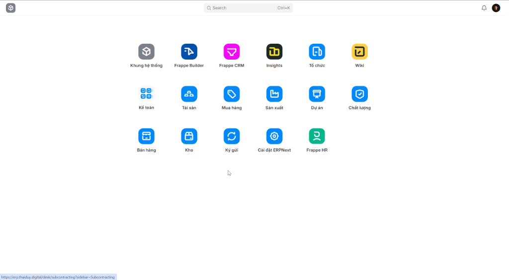
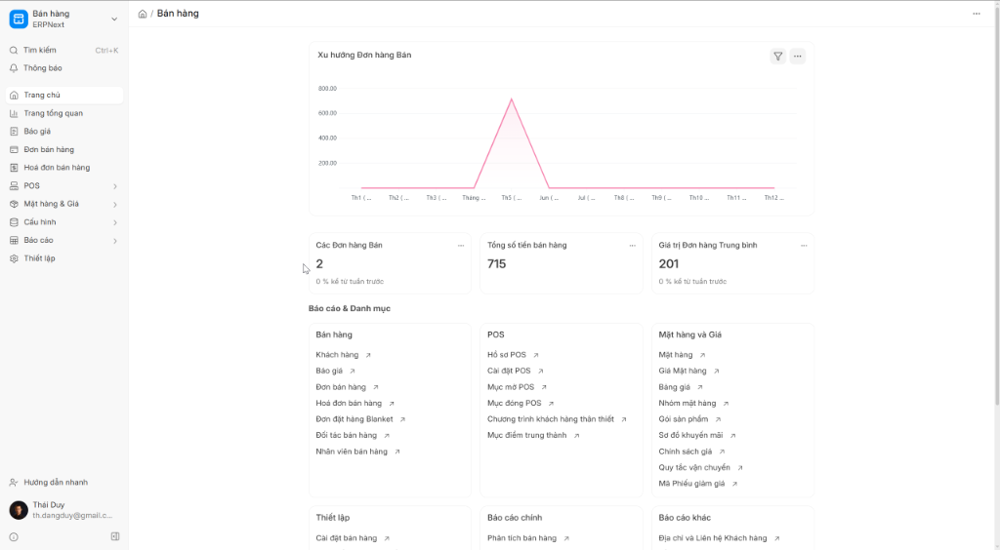
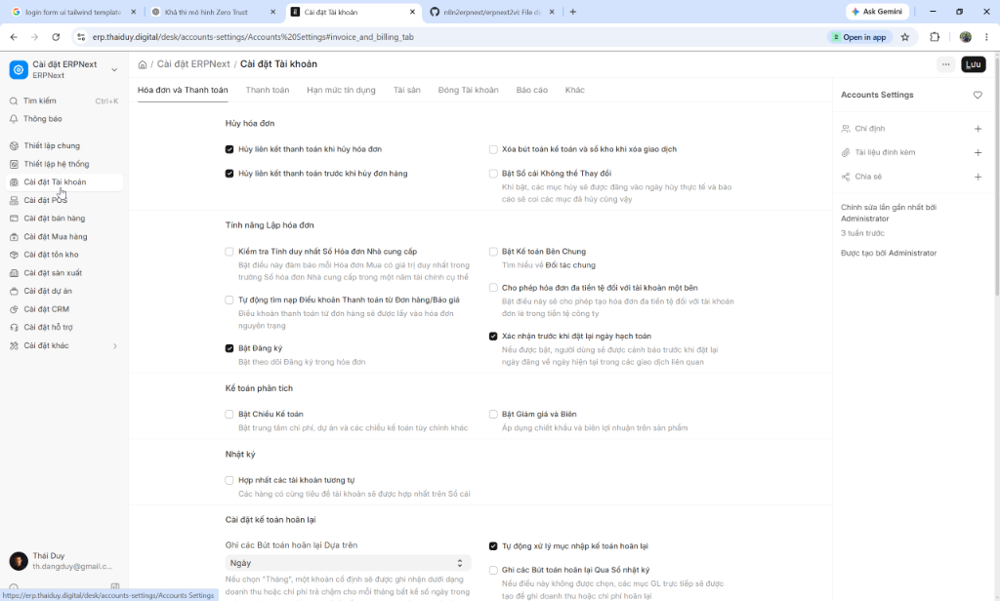
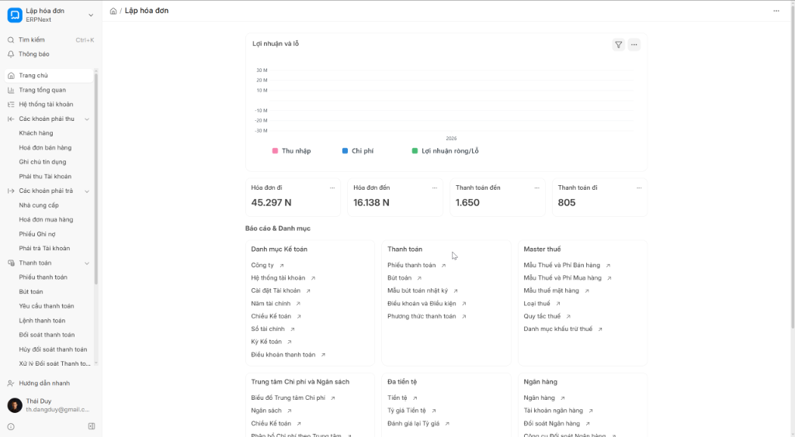

# ERPNext / Frappe Vietnamese Localization

Bộ bản địa hóa tiếng Việt cho hệ sinh thái **Frappe / ERPNext v16**, tập trung vào cách dùng thực tế của doanh nghiệp Việt Nam thay vì dịch từng từ máy móc. Repository có hai lớp cài độc lập: **PO/MO catalog** cho chuỗi dịch runtime và **UI JSON override bundle** cho các object chuẩn như Dashboard Chart, Number Card, Dashboard và Workspace vốn được lưu trong database. Nội dung hiện đã trải qua đợt **Semantic v3 QA**: chuẩn hóa nghiệp vụ ERP, làm sạch giao diện Anh–Việt lẫn lộn và kiểm tra cách các chuỗi từ nhiều app ghép với nhau ở runtime.

## Mục tiêu

Bản dịch hướng tới ba tiêu chí: **đúng nghiệp vụ**, **tự nhiên khi hiển thị**, và **nhất quán xuyên app**. Một chuỗi có thể đúng khi đứng riêng nhưng vẫn sai khi Frappe ghép nó với label từ CRM/ERPNext/HRMS/Insights; vì vậy project kiểm cả từng `msgid/msgstr` lẫn các fragment runtime như `{0} Name`, `{0} Report`, `{0} Settings`, `{0} Calendar`.

Ví dụ vocabulary đã chuẩn hóa:

| Khu vực | English | Tiếng Việt |
| --- | --- | --- |
| Frappe UI | Desktop / Workspace | Tổng quan / Khu làm việc |
| Frappe UI | Web Form / Website | Biểu mẫu web / Trang web |
| Frappe UI | Timeline | Lịch sử |
| CRM | Lead / Deal | Khách hàng tiềm năng / Cơ hội bán hàng |
| HRMS | Attendance / Shift | Chấm công / Ca làm |
| HRMS | Employee Checkin | Ghi nhận chấm công nhân viên |
| HRMS | Designation | Chức vụ |
| Stock | Stock Entry / Stock Ledger | Phiếu kho / Sổ kho |
| Buying | Purchase Order / Purchase Receipt | Đơn mua hàng / Phiếu nhập hàng |
| Selling | Sales Order / Sales Invoice | Đơn bán hàng / Hoá đơn bán hàng |
| Accounting | Journal Entry / Payment Entry | Bút toán / Phiếu thanh toán |
| Accounting | Dunning | Nhắc nợ |
| Stock/Buying | Landed Cost | Chi phí nhập hàng |
| Manufacturing | Work Order / Job Card | Lệnh sản xuất / Phiếu công đoạn |
| Manufacturing | Subcontracting | Gia công |
| Insights | Workbook | Sổ làm việc |

## Thuật ngữ chủ động giữ tiếng Anh

Không Việt hóa cực đoan. Những thuật ngữ kỹ thuật hoặc vận hành đã quen thuộc được giữ nguyên khi đúng ngữ cảnh, ví dụ: `ERP`, `CRM`, `POS`, `SLA`, `API`, `Dashboard`, `Workflow`, `Sync`, `Log`, `Serial`, `Batch`, `Import`, `Export`, `Filter`, `Theme`, `Webhook`, `Queue`, `Cache`, `Role`, `Permission`, `Session`, `Token`, `SQL`, `OAuth`, `JSON`, `Jinja`.

Điểm quan trọng là **giữ theo ngữ cảnh nguồn**. Ví dụ `Theme` được giữ nguyên, nhưng `Subject` phải là `Chủ đề`; `Dashboard` được giữ nguyên, nhưng không được biến mọi “bảng điều khiển” ngoài ngữ cảnh thành `Dashboard`.

## Các catalog

| File | App | Đường dẫn đích |
| --- | --- | --- |
| `frappe_vi_v2.po` | Frappe Framework | `apps/frappe/frappe/locale/vi.po` |
| `erpnext_vi_v2.po` | ERPNext | `apps/erpnext/erpnext/locale/vi.po` |
| `hrms_vi_v2.po` | HRMS | `apps/hrms/hrms/locale/vi.po` |
| `crm_vi_v2.po` | Frappe CRM | `apps/crm/crm/locale/vi.po` |
| `insights_vi_v2.po` | Frappe Insights | `apps/insights/insights/locale/vi.po` |

## UI JSON override bundle

Một số label chuẩn của Frappe không đi qua PO catalog. Ví dụ tên `Dashboard Chart`, `Number Card`, `Dashboard` và `Workspace` được sync từ JSON của app vào database. Frappe hỗ trợ `export-json` / `import-doc`, vì vậy project đóng gói chúng thành **5 doclist JSON có thể cài lại độc lập**, không cần sửa source app.

| File | App | Object hiện có |
| --- | --- | ---: |
| `ui_json/frappe_vi_ui_v3.json` | Frappe | 20 |
| `ui_json/erpnext_vi_ui_v3.json` | ERPNext | 107 |
| `ui_json/hrms_vi_ui_v3.json` | HRMS | 80 |
| `ui_json/crm_vi_ui_v3.json` | Frappe CRM | 1 |
| `ui_json/insights_vi_ui_v3.json` | Frappe Insights | 0 |

Bundle **giữ nguyên `name` và các key liên kết gốc** (`link_to`, `chart_name` trong Workspace content, `number_card_name`, `card_name`...) để không phá reference. Chỉ field hiển thị như `chart_name`, `label`, `dashboard_name` và header/label của Workspace được Việt hóa. Insights hiện không có standard object thuộc 4 loại này ở version đã audit nên file là `[]`; file vẫn được giữ để cấu trúc 5-app nhất quán và sẵn sàng cho lần rebuild sau.

Baseline dùng để tạo bundle hiện tại: Frappe 16.17.0, ERPNext 16.16.0, HRMS 16.5.4, CRM 2.0.0-dev (`4213ae6`) và Insights 3.3.1 (`0418003`). Sau khi nâng app hoặc chạy migrate làm upstream fixture ghi đè label, chỉ cần import lại bundle phù hợp.

## Semantic v3 QA

Validator hiện kiểm **19.916 translation entry** trên 5 catalog và **19.146 unique msgid**. Các lớp kiểm chính:

- placeholder `{0}`, `%s`, `%(name)s`, JS template, Jinja và cấu trúc HTML;
- semantic rule theo `msgid`, tránh sửa global gây sai ngữ cảnh;
- vocabulary ERP canonical như `Valuation Rate`, `Posting Date`, `Stock Entry`, `Landed Cost`, `Dunning`, `Subcontracting`;
- exact-English gate: chuỗi user-facing giữ nguyên English phải nằm trong allowlist đã review;
- cross-app consistency: cùng `msgid` giữa các app mặc định phải cùng bản dịch;
- collision có chủ đích được khai báo riêng, ví dụ `{0} M` là **phút** ở CRM nhưng **tháng** trong Frappe pretty-date;
- runtime composition contract cho các fragment Frappe. Ví dụ `Tên {0}`, `Báo cáo {0}`, `Cài đặt {0}`, `Lịch {0}`, nhưng `{0} trường` vẫn giữ số đếm trước danh từ.

Chạy validator không cần dependency ngoài Python chuẩn:

```bash
python3 validate_semantics.py
python3 validate_ui_json.py
```

Trạng thái chuẩn trước khi commit phải là:

```text
Cross-app composition: 19146 unique msgids checked, 0 conflicts
Checked 19916 entries across 5 files
PASS: semantic glossary and format invariants are clean
```

## Tooling

- `Translator.cs`: post-processor source-aware, có dictionary ERP canonical và repair rules cho lỗi dịch máy đã biết.
- `MergePo.cs`: đồng bộ catalog khi upstream thay đổi.
- `validate_semantics.py`: semantic/format/cross-app QA chính cho PO catalog.
- `build_ui_json_bundles.py`: dựng lại 5 UI JSON bundle từ snapshot `export-json` và glossary PO Semantic v3.
- `validate_ui_json.py`: kiểm cấu trúc, baseline object count và các label UI nhạy cảm của JSON bundle.
- `validate_translations.ps1`, `verify_po.ps1`: bộ kiểm tra PowerShell bổ sung cho môi trường Windows.

Một nguyên tắc quan trọng của `Translator.cs`: **không replace theo tiếng Việt một cách global nếu một từ có nhiều nghĩa**. Mọi family nhạy cảm như `Theme/Subject`, `Lead/Deal`, `Employee Checkin`, `Landed Cost`, `Dashboard` đều được gate bằng English `msgid`.

## Cài đặt vào bench

Sao chép catalog vào đúng app:

```bash
cp erpnext_vi_v2.po apps/erpnext/erpnext/locale/vi.po
cp frappe_vi_v2.po apps/frappe/frappe/locale/vi.po
cp hrms_vi_v2.po apps/hrms/hrms/locale/vi.po
cp crm_vi_v2.po apps/crm/crm/locale/vi.po
cp insights_vi_v2.po apps/insights/insights/locale/vi.po
```

Sau đó compile catalog, build message files phía client và làm mới cache:

```bash
bench compile-po-to-mo --force --locale vi
bench build-message-files
bench --site [site-name] clear-cache
```

Với UI JSON bundle, import theo app đang cài trên site:

```bash
bench --site [site-name] import-doc /path/to/ui_json/frappe_vi_ui_v3.json
bench --site [site-name] import-doc /path/to/ui_json/erpnext_vi_ui_v3.json
bench --site [site-name] import-doc /path/to/ui_json/hrms_vi_ui_v3.json
bench --site [site-name] import-doc /path/to/ui_json/crm_vi_ui_v3.json
# insights_vi_ui_v3.json hiện rỗng, không cần import
bench --site [site-name] clear-cache
```

`import-doc` dùng `name` gốc để insert/update document, nên bundle có thể chạy lại sau khi app update hoặc fixture sync trả label về English. Không cần chạy `migrate` chỉ để áp PO/JSON localization; hãy chạy migrate theo quy trình nâng app riêng của bench. Sau khi deploy, hard refresh trình duyệt hoặc đăng xuất/đăng nhập lại. Nếu site không cài một app thì bỏ qua catalog và JSON bundle của app đó.

## Hình ảnh minh họa giao diện

### Trang Tổng Quan


### Khu làm việc Bán Hàng


### Cài Đặt Tài Khoản


### Khu làm việc Lập Hóa Đơn

